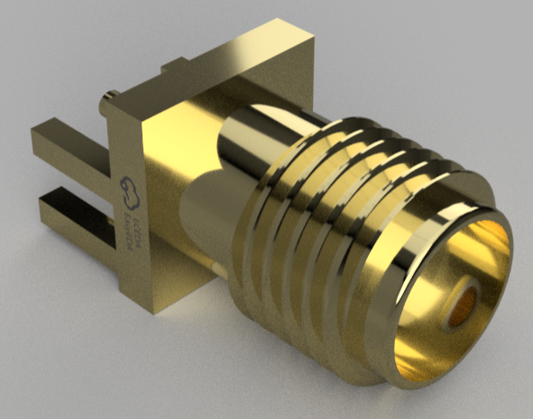

<div center=align>
  <h1>个人自用3D模型库</h1>
</div>

<h2>目前已有</h2>

- 亚克力类
    - 四方透明六面水晶螺母
<div align=center></div>


- 电子器件类

    其他-蜂鸣器(BUZ-SMD_3P-L5.2-W5.2-P3.50-BR)
<div align=center></div>

	- 其他-TF
<div align=center></div>

	- 其他-SMA
<div align=center></div>

    - 电容(C0603 C0805)
<div align=center></div>
<div align=center></div>

    - 电阻(R0603)
<div align=center></div>

    - 电感(L0603)
<div align=center></div>

    - GH1.25插头(4Pin 6Pin)
<div align=center></div>
<div align=center></div>

    - 排针排母(SMD-N-5Pin TH2Pin TH7Pin)
<div align=center></div>
<div align=center></div>
<div align=center></div>

    - LED(LED0603)
<div align=center></div>

    - LQFP (48Pin)
<div align=center></div>

    - PQFP (144Pin)
<div align=center></div>

	- SOP (16Pin)
<div align=center></div>

	- SOD (523)
<div align=center></div>

    - TSSOP (28Pin)
<div align=center></div>

    - 晶振
<div align=center></div>

    - 开关
<div align=center></div>
<div align=center></div>

    - USB(Typec 6Pin)
<div align=center></div>


- 器材

```
- Fan 40*40*20
```

<div align=center></div>
